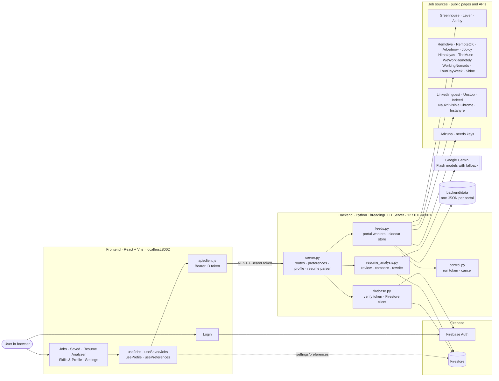
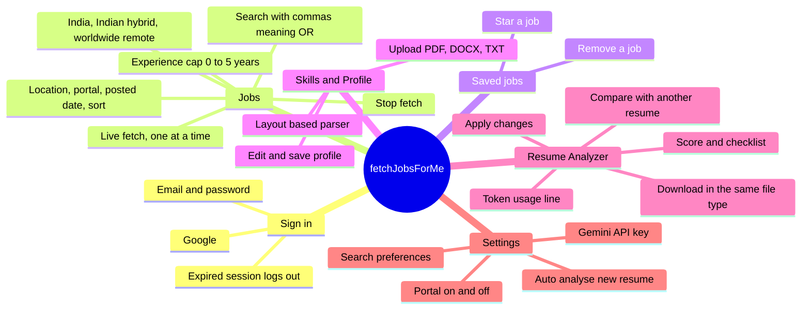
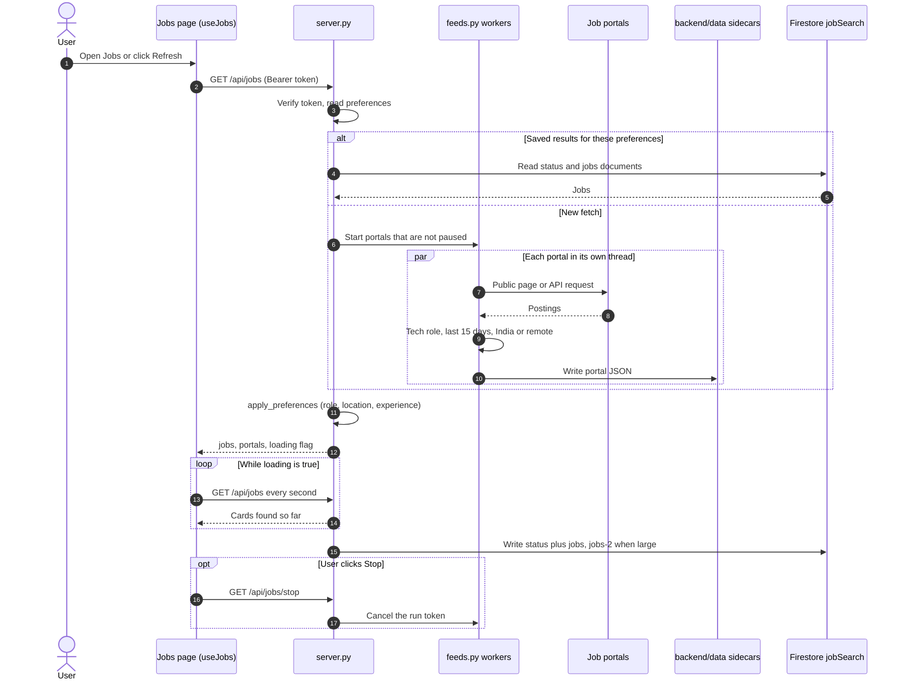
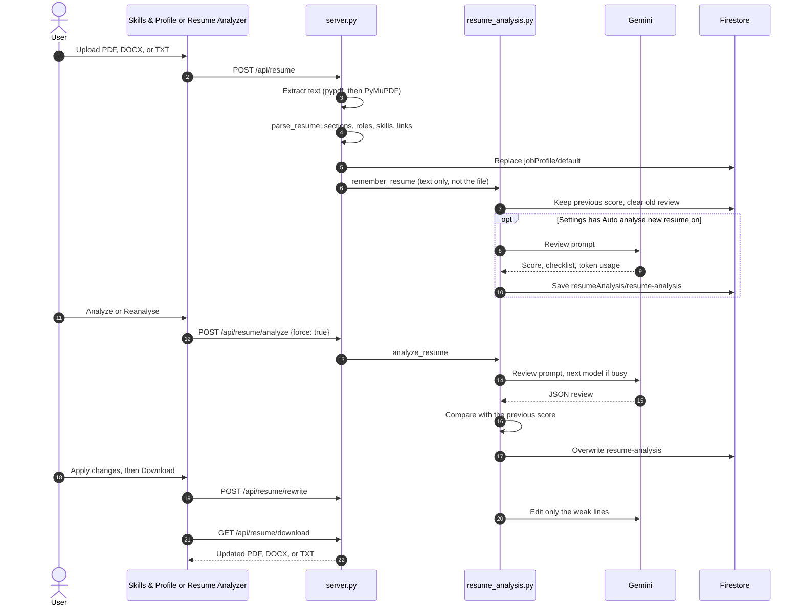
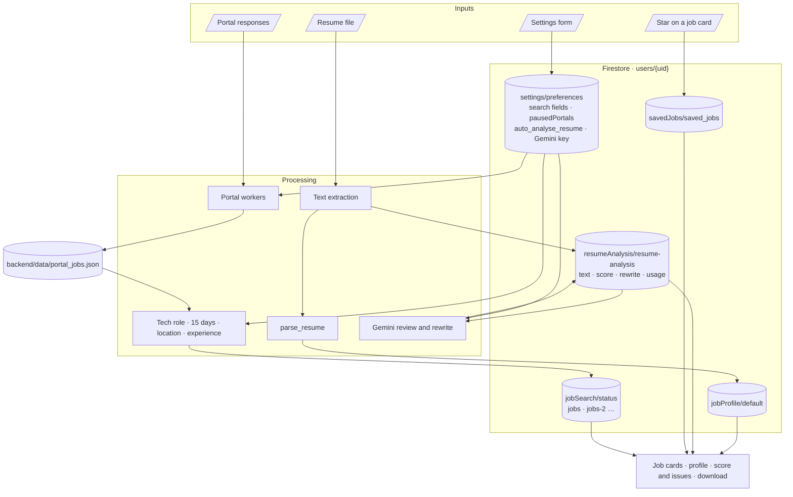
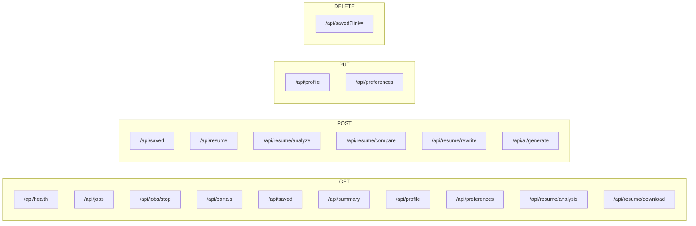

# fetchJobsForMe

A personal CSE/IT job finder. It fetches jobs from public job-board pages and APIs, filters them by each user's search preferences, keeps saved jobs and a parsed resume per user in Firebase, and reviews the resume with Gemini.

The diagrams below are Mermaid. GitHub and the Cursor Markdown preview draw them from this file, so they change as soon as this file changes.

## Architecture



## Functional map



## Job fetch flow



## Resume flow



## Data flow



The Gemini key stays in `settings/preferences`. The preferences API never returns it. Uploaded resume files are not stored, only the extracted text.

## API routes



Every route except `/api/health` and `/api/portals` reads the user from the `Authorization: Bearer` Firebase ID token.

## Setup

Install the backend packages once:

```powershell
pip install -r backend/requirements.txt
```

Run the commands below from the project folder with Python 3.10 or newer.

## Fetch jobs

Every portal, up to 5 jobs each:

```powershell
python backend/Server/server.py --source all --query engineer --limit 5 --no-open
```

`--source` defaults to `all`, so this is the same search:

```powershell
python backend/Server/server.py --query engineer --limit 5 --no-open
```

One portal:

```powershell
python backend/Server/server.py --source arbeitnow --query automation --limit 5
```

Portals: `greenhouse`, `lever`, `ashby`, `remotive`, `remoteok`, `arbeitnow`, `adzuna`, `linkedin`.

```powershell
python backend/Server/server.py --list
```

`--limit` is the number of jobs per portal. `--query` matches the title, company, or location. `--where` matches a city or location. `--no-open` prints the LinkedIn search link without opening the browser.

Each job is printed as JSON with company, role, experience, skill, salary, added on, location, description, and link. `description` has `about company` and `job description`. With `--source all`, each record also includes `portal`.

## One company or a few companies

Greenhouse, Lever, and Ashby search the company list in `backend/connectors/companies.py`. To search only some of those companies, pass their board tokens with `--boards`:

```powershell
python backend/Server/server.py --source greenhouse --boards discord --query engineer --limit 5
```

```powershell
python backend/Server/server.py --source all --boards discord,cloudflare,spotify --query engineer --limit 5 --no-open
```

`--boards` applies to Greenhouse, Lever, and Ashby. A token that is not on that portal is skipped. Remotive, RemoteOK, and Arbeitnow do not use company tokens.

## Sort

`--sort` accepts `salary`, `date` (added on), and `exp` (experience). Separate keys with commas.

| Command | Order |
|---|---|
| `--sort salary` | Highest pay first |
| `--sort date` | Newest added on first |
| `--sort exp` | Lowest experience first |
| `--sort salary_asc` | Lowest pay first |
| `--sort date_asc` | Oldest added on first |
| `--sort exp_desc` | Highest experience first |
| `--sort salary_asc,date_asc` | Lowest pay first, then oldest date |

Jobs with a blank salary, date, or experience stay at the end.

```powershell
python backend/Server/server.py --source all --query automation --limit 5 --sort salary --no-open
```

```powershell
python backend/Server/server.py --source arbeitnow --query automation --limit 5 --sort exp_desc
```

## Jobs page (web app)

The same jobs can be browsed in the browser. Start the API in one terminal:

```powershell
python backend/Server/server.py
```

That serves `http://127.0.0.1:8001/api/jobs`. A fetch keeps openings from the last 15 days and writes one file per portal under `backend/data/` as results arrive, so the jobs page shows cards while other portals are still loading. The finished list for each user is also saved in Firestore. Refresh starts that fetch again. The jobs page shows 20 jobs per page. Search, portal, date, and sort run in the browser.

Start the web app in a second terminal:

```powershell
cd frontend
npm install
npm run dev
```

Open [http://localhost:8002/jobs](http://localhost:8002/jobs) and sign in. The page has search, location, and portal, plus posted-date buttons (Today, Last 7 days, Last 30 days) and sorting, which apply instantly to the loaded list. Each card shows the company, role, location, work mode, experience, salary, and an Apply link on the right. Click a card to open the description underneath it.

Point the page at a different API host with `VITE_JOBS_API_URL` in the repository `.env`.

## Adzuna

Adzuna is skipped until both keys are set. Create them at [developer.adzuna.com](https://developer.adzuna.com/).

```powershell
$env:ADZUNA_APP_ID = "your-app-id"
$env:ADZUNA_APP_KEY = "your-app-key"
python backend/Server/server.py --source adzuna --query engineer --where Bengaluru --country in
```
